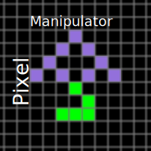

#  PixelManipulator

PixelManipulator is a JavaScript library that can run any cellular automata on
an html5 canvas, such as "Conway's Game of Life," and "Rule 90." Inspired by the
[The Powder Toy](https://powdertoy.co.uk/), but made as a JavaScript library for
web-browsers.

[repo]: https://github.com/lazerbeak12345/pixelmanipulator
[the demo]: https://lazerbeak12345.github.io/pixelmanipulator/pixelmanipulator.html

[][the demo]

## Getting Started

Download `pixelmanipulator.js` from [the repo][repo] and include this in your html:

```html
<!doctype html>
<html>
	<head>
		...
		<!-- Replace this with the proper location of the file. -->
		<script src="pixelmanipulator.js"></script>
		...
	</head>
	<body>
		...
		<!-- The canvas element to render to. -->
		<canvas id="myCanvas"></canvas>>
		...
		<!-- Near the end of the code to ensure pixelmanipulator.js loaded -->
		<script>
			//Get the canvas element and tell PixelManipulator to use it
			p.canvasPrep({
				canvas:document.getElementById("myCanvas"),
			});
			// An example element to get you started.
			p.addElement("Conway's Game Of Life",{
				color:[0,255,0],//what rgb color it is
				pattern:"B3/S23",//born on 3, survives on 2 or 3
			});
			p.play({}); // Final initialization, and play
			// Randomly fill 15% of the canvas with this element.
			p.randomlyFill(15,"Conway's Game Of Life");
		</script>
	</body>
</html>
```

Pixelmanipulator supports various browser-side module loaders.

## What is Conway's game of Life

Conway's game of life is a cellular automata with a few simple rules.
All of these rules use a distance formula where it counts the both the pixels
that are immidately touching the edges and the pixels that are immidately
touching the corners.
For example (givin that `O` is the cell, and `X` is one that is checked in the
moore distance fourmula):

    XXX
    XOX
    XXX

On an empty cell, if there are exactly three(3) living cells around it, then it
is born.
A cell will remain alive if there are exactly two(2) or three(3) living cells
nearby.
Elsewise, the cell either remains dead, or becomes dead.

### Adding a basic life-type cellular automata

For life-type cellular automata (cellular automata that are like Conway's game
of Life, but have different rules), there is a specific syntax for how to
specify them: `B3/S23`. This syntax literally means "born on three(3), survive
on two(2) or three(3)."

The example code above included `B2/S23` (AKA "Conway's game of Life") as an example. Feel free to try out other patterns, like

- Seeds `B2/S`
- Highlife `B36/S23`
- And more! (262144 combinations, `2^(9+9)`) 

## Documentation

Function-by funciton documentation. (Updated last on version `3.1.0`)

### The global

While everything here is in the scope of `window.p`, there is also
`window.pixelmanipulator`.

If a module-loader is detected, this library will use that instead of polluting
the global namespace.

### Media Controls

Pause, play, reset, and iterate.

#### Pause

`p.pause()`

Takes no arguments, returns nothing.

Sets `p.mode` to `"paused"` and clears the interval represented by `innerP.loopint`.

#### Play

`p.play()`

Takes one optional argument, passed to `p.reset`.
If no arguments are passed in, `p.reset()` is not called.

Returns nothing.

Sets `p.mode` to `"playing"`, and sets a new interval, saving it in `innerP.loopint`.

#### Reset

`p.reset();` resets/initializes the canvas.

It only accepts one optional argument, an object with the following properties

```js
{
	//width of the canvas (optional)
	canvasW:100,
	//height of the canvas (optional)
	canvasH:100,
	//width of the zoom canvas (size in zoomed pixels) (optional)
	zoomW:10,
	//height of the zoom canvas (size in zoomed pixels) (optional)
	zoomH:10
}
```

Returns nothing.

Calls `p.pause` `p.updateData` `p.update` and resets all internal state,
excluding the element definitions.

#### Iterate

`p.iterate();` is the function that is passed into the setIterval function.
Calling this will trigger a single frame of animation.

> Be careful! Calling this while `p.mode` is `"playing"` might cause two
> concurrent calls to this function. If any of your automata have "hidden state"
> - that is they don't represent every detail about themselves as data within
> the pixels - it might cause conflicts. I haven't seen any issues caused by
> this thus far, but it still bears a warning.

### Element registration

There are two functions in PixelManipulator that allow for the creation of
Cellular automata. `p.addElement` and `p.addMultipleElements`.

#### addElement

As the syntax for `p.addElement` is usually something like this:

```js
p.addElement("Conway's Game Of Life",{
	color:[0,255,0],
	pattern:"B3/S23",
});
```

However, it is possible to do this with the same result:

```js
p.addElement({
	name:"Conway's Game Of Life",
	color:[0,255,0],
	pattern:"B3/S23",
});
```

All of the properties that this object can accept are these:

```js
{
	// The name of the element. Gets overrulled by the first argument to addElement
	name:"Name",
	// The rgba color of the element. If there is less than 4 values in this array,
	// the end of the array is padded with the number 255. (if missing entirely,
	// the color is white) NOTE THAT NO TWO ELEMENTS MAY HAVE EXACTLY THE SAME
	// COLOR (Starting in version 3 this will throw an error)
	color:[255,255,255,255],
	// See more about the pattern value in "About The Pre-built classes"  This is
	// an optional value
	pattern:"B3/S23",
	// See more about `liveCell` and `deadCell` in "Custom Cellular Automata". Both
	// of these are optional, but when present, overrules what `pattern` may have
	// applied to it.
	liveCell:function() {},
	deadCell:function() {},
}
```

#### addMultipleElements

`p.addMultipleElements` can make your code more readable and passes in the input
value you give it to `p.addElement`. Its syntax is as follows:

```js
p.addMultipleElements({
	"Conway's Game of Life":{
		color:[0,255,0],
		pattern:"B3/S23",
	}
	"Highlife":{
		color:[0,255,128,255],
		pattern:"B36/S23"//born on 3 or 6, survives on 2 or 3
	},
});
```

#### About The Pre-built classes

As shown in Getting Started, there are "Lifelike" automata. But there are also "Wolfram" automata.

##### Lifelike

As shown above, one can initialize an instance of Conway's Game of Life by doing the following:

    p.addElement("Conway's Game Of Life",{
        color:[0,255,0,255],
        pattern:"B3/S23",
    });

This uses the moore distance formula (see above) to calculate the quantity of
nearby cells of this same type. The non-case sensative pattern you see above can
be read as "A cell is born (or switches from an off state to an on state) if
there are exactly three nearby neighbors of this same cell type, and it will
survive (or continue to stay as an on state) if there are exactly two or exactly
three cells of this same type nearby."

This can accept any number of numbers for either input, as long as they are
whole numbers from zero(0) to eight(8), due to the fact that that is the
physical limit.

> Note that the presence of the number 9 will fail silently, and act as if that
> digit is not present.

##### Wolfram

Wolfram definitions are rather interesting. Here's an example of one:

```js
p.addElement("Rule 30",{
	color:[255,0,255,255],
	pattern:"Rule 30",
});
```

The pattern must start with the word (not case sensitive) "Rule" followed by a
space. It then must be followed by a number from 0 to 255.

This number will be transalated into a binary string. In the case of the example
above, "`00011110`."

Wolfram Rules don't use the Moore area formula, they use the Wolfram area
formula.

    XXX
     O

This remarkably different formula relies that per each frame, only one line
changes at a time. Each cell, as shown above, depends on the 1(same cell
present) or 0(same cell not present) state of the cells directly, and to either
side above this cell.

We then iterate through each digit of the above number, while counting up from
`000` in binary. (For example, `000` and `0`, `001` and `0`, `010` and `0`,
`011` and `1`, etc).

If the three-digit binary number correctly matches the state of the cells above
this one, then the state of this cell becomes the value of the corrosponding
digit in the long binary string. (for example, if it matches in a `000` pattern
than it remains dead., but if it matches in a `011` pattern, then the cell
becomes alive.)

### Custom Cellular Automata

#### liveCell, deadCell

`liveCell` and `deadCell` are properties of an element that is passed into the
addElement function.

Each frame of animation pixelmanipulator iterates through each and every pixel
on screen.
When it comes to either the default pixel (usually `"blank"`) or this pixel, it
calls the respective live or dead cell function.

> If you want to do something once each frame, instead of once per pixel, see
> `onIterate` and `onAfterIterate`

When defining a custom element, it is needed to decide upon which, if not both,
of these two functions will be needed.
Will your automata be doing something when it detects that the current cell is
blank, or when it detects that the current cell is a specific element type?
For the former, use `deadCell`, and for the latter, use `liveCell`.

Lastly, there is a single callback to these two functions, and it is an object
in the following shape (in the source code, referred to as `rel`):

```js
{
	x:0,
	y:0,
	// Takes
	// - the x and y position to center the counter around,
	// - the identifer (passed to confirmOldElm and can take any value that can)
	// - and an optional boolean of wether to loop or not (passed to confirmOldElm).
	// 
	// Returns the number of nearby cells.
	mooreNearbyCounter:function(x,y,name,loop){},
	// Takes
	// - the x and y position to center the counter around,
	// - the identifer (passed to confirmOldElm and can take any value that can)
	// - a string (made of `"1"` and `"0"`) or number, used as a bit field,
	//   representing the desired match.
	// - and an optional boolean of wether to loop or not (passed to confirmOldElm)
	// 
	// Returns a boolean if the bitfield matches.
	wolframNearby:function(){}
	// These each take the same arguments and return the same values as the
	// corresponding function in `p` but returns the value from the last frame.
	getOldPixel:function(x,y,loop){},
	getOldPixelId:function(x,y,loop){},
	confirmOldElm:function(x,y,id,loop){},
	whatIsOld:function(x,y,loop){},
}
```

#### Pixel interaction

`setPixel` and `getPixelId` is the basis around what PixelManipulator works.
All of the other functions in the name of this header are all based upon adding
functionallity to these two functions.

##### Looping

Looping is the behavior where if a corordinate is out of bounds, it is corrected.

For example, if you place a pixel 100px left of the screen, and looping is on,
the x-position, assuming that the width of the screen is <= 100, will be 100.

##### setPixel

`setPixel`, as can be inferred by its name, sets a pixel in a given location.

Arguments:

- `x` x position. number
- `y` y position. number
- `ident` Value to identify the element.
  - If a string, it assumes it's an element name.
  - If a number, it assumes it's an element ID
  - If an array, it assumes it's an 4-long color array.
- `loop`. Optional. Wraps `x` and `y` around canvas borders.

Returns nothing.

##### getPixelId

Return a number uniquely identifying this element type of the cell at the given
coordinates. `p.getPixelId(x,y,loop)`

Arguments:

- `x` x position. number
- `y` y position. number
- `loop`. Optional. Wraps `x` and `y` around canvas borders.

Returns number

> This is effected by `setPixel` in the current frame.

##### getPixel

Return the current rgba value of the cell at the given corordinates. `p.getPixel(x,y,loop)`

Arguments:

- `x` x position. number
- `y` y position. number
- `loop`. Optional. Wraps `x` and `y` around canvas borders.

Returns array of 4 numbers

> This is effected by `setPixel` in the current frame.

##### confirmElm

`confirmElm` returns a boolean stating wether the cell at the x and y position
is the passed-in element name. `p.confirmElm(x,y,"Name of element to query")`

Arguments:

- `x` x position. number
- `y` y position. number
- `ident` Value to identify the element.
  - If a string, it assumes it's an element name.
  - If a number, it assumes it's an element ID
  - If an array, it assumes it's an 4-long color array.
- `loop`. Optional. Wraps `x` and `y` around canvas borders.

> This is effected by `setPixel` in the current frame.

##### whatIs

Returns name of element at passed-in location. `p.whatIs(6,5);`

Arguments:

- `x` x position. number
- `y` y position. number
- `loop`. Optional. Wraps `x` and `y` around canvas borders.

Returns string

> Not very slow anymore, but it's still a string. Much slower than comparing an 
> ID number

> This is effected by `setPixel` in the current frame.

### Other

This is the rest of the library

#### p.canvasPrep

Another value, this one optional, is the key `zoom`, and it must be a html5 canvas.
This is a movable, scaled viewport.
In the demo, this is where a user clicks to mannually place cells.

One required argument, an object in this format:

```js
{
	// An html5 canvas to render on. (To scale)
	canvas:canvas,
	// An html5 canvas. (Optional). Zoomed-in
	zoom:zoom
}
```

> `canvasPrep` calls `updateData` automatically

#### p.update

Not to be confused with `p.updateData`, `update` applies any changes made
with `setPixel` to the canvas, and shows them on the zoomElm if it is
present.

In the demo, this is used to show changes the users make when they click on the
zoomElm.

Takes no arguments, returns nothing.

> `p.update` calls `p.zoom` automatically, but only if there is a zoom elm

#### p.zoom

Initially a click envent handler from mid to late version 0 all the way to early
version 1, zoom takes in an object that contains `x` and `y`. If these values
are missing, the last values (saved at `p.zoomX` and `p.zoomY`, respectivly) are
used.

Arguments:

- Optional object with these keys:
  - `x` Optional position to center the zoom elm on. (If absent, uses `p.zoomX`)
  - `y` Optional position to center the zoom elm on. (If absent, uses `p.zoomY`)

This tells pixelmanipulator where to focus the center of the zoomElm (or zoom-box).

Also renders a grid on the zoom element.

#### p.updateData

A function that sets things such as `imageSmoothinEnabled` to be `false`, and defines `getPixel`, `confirmElm`, and `whatIs`.

#### onIterate and onAfterIterate

These functions get called before and after the `iterate` function does it's work (respectfully).

#### version

This is a string indicating the version of the library. Follows [semver](https://semver.org).

#### licence

This is a string containing basic licencing information, and is automatically printed to the terminal at startup. More licencing info can be found at [LICENCE](LICENCE)

#### loopint

This is the number that indicates what interval the iterate function is being called with.

> You can use this to mannually stop the iterations like so: `clearInterval(p.loopint);` (not reccommended)

#### zoomX and zoomY

The coordinates of where the center of the zoomelm is windowed at.

#### get and set width an height

`get_width` and `get_height` take no args and return the width or height, respectively.

`set_width` and `set_height` take one arg (the width or height, respectively) and return nothing.

#### row

The row that elements such as `Rule 90` are getting proccessed at.

[bug23]: https://github.com/Lazerbeak12345/pixelmanipulator/issues/23

> This is actually a symptom of [a bug][bug23]. A later major version release will have
> the goal of removing this, and the associated bug.

#### elementTypeMap

A low-level listing of the availiable elements.

> This has been around since late version 0!

Format is much like the argument to `p.addMultipleElements`, but is sanitized.

Includes a `number` value that serves as the element's ID number

#### elementNumList

A list of all string-names in `p.elementTypeMap`, in order of ID number.

#### mode

A string indicating weather it is currently animating or not.

It is `"playing"` if it is currently animating, or `"paused"` if not currently animating.

> This has been around since early version 0, and once was the `innerText` value of a pause/play button!

#### zoomScaleFactor

How many times bigger should the zoom elm be as compared to the actual size found in the normal canvas?

#### zoomctxStrokeStyle

The color of the lines drawn on the zoom elm.

#### defaultElm

The elm that pixelmanipulator will fill the screen with upon initialization, and
what elements should return to when they are "dead". Default value is `'blank'`,
an element with the color `#000F`

> This is using a getter and setter - and is slow anyway as it's a string. use 
> `p.defaultId` instead.

#### defaultId

The elm that pixelmanipulator will fill the screen with upon initialization, and
what elements should return to when they are "dead". Default value is `0`.

#### presentElements

An array of any elements that should be on screen.
This is appended to by `setPixel`, and is currently the limiter that `iterate`
uses. `iterate` will only call deadCell for elements in this list.
